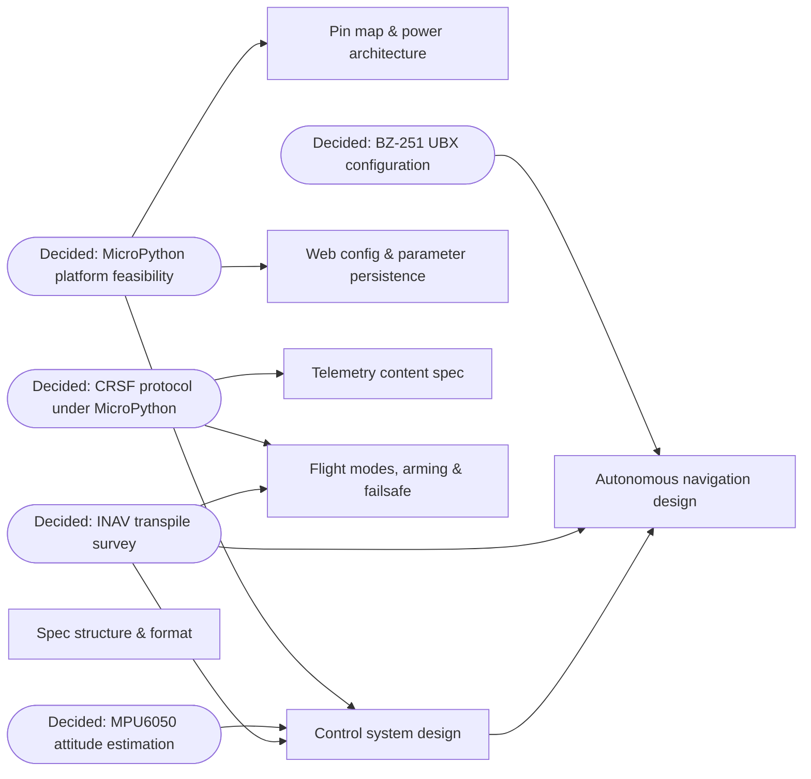

# Map: Pico W Fixed-Wing Flight Controller

## Destination

A complete spec for a MicroPython flight controller on the Raspberry Pi Pico W for a V-tail fixed-wing drone: system inputs and outputs, protocols, and per-part definitions precise enough that each part can be developed independently and then assembled. The map is done when that spec exists — building and flying are beyond it.

## Notes

- **Domain:** hobby fixed-wing FC; MicroPython on Pico W (RP2040). Timing precision requirements are relaxed (fixed-wing loop rates), per the owner.
- **Hardware (fixed):** Raspberry Pi Pico W · MPU6050 (I²C) · BZGNSS BZ-251 GPS (u-blox M10, UART/UBX; **also carries an onboard QMC5883 compass, I²C** — corrected 2026-07-29, was assumed absent) · ELRS receiver (CRSF, UART) · one ESC with BEC on Oneshot125 · 2 V-tail servos (digital, standard PWM) · power via ESC BEC, no battery voltage sensing.
- **Decided during charting** (owner grilling, recorded here as standing constraints):
  - Platform: **MicroPython**.
  - Modes: **manual**, **stabilized**, **autonomous** (waypoint navigation via GPS); mode select via TX channel.
  - **V-tail only** mixer config.
  - WiFi: Pico W **hosts its own AP**, **only while disarmed**; simplest-possible interface (HTML forms).
  - **All** parameters configurable via the web server: PIDs, rates, mixing, failsafe, modes.
  - Failsafe: RC link lost → level wings + cut throttle; GPS lost in autonomous → same (level out, cut throttle).
  - Arming: **TX switch channel**; only pre-arm check is **zero throttle**.
  - **Implementation strategy: transpile from INAV.** INAV (C, fixed-wing-focused FC firmware) is the reference base — control loops, mixer, navigation, and protocol handling are ported module-by-module from INAV's source to MicroPython, rather than designed from scratch. This grounds every algorithm in proven code and reduces hallucination. Where INAV and these notes disagree (e.g. estimator choice), INAV's approach is the default and deviations must be justified in the part's Decision.
- **Skills:** use `/domain-modeling` for terminology (modes, mixer, failsafe); `/grilling` for HITL parts; `/research` subagents for research parts.

## Parts

*Terminal rendering: `scripts/diagram` (this map) · `scripts/diagram <file.md> [n]` for any doc — see `scripts/diagram --help`.*

## Decisions so far

- [Research: MicroPython platform feasibility](./pico-wing-fc/research-micropython-platform.md) — feasible, no blockers; single-core asyncio, microdot web while disarmed, PWM-slice Oneshot125.
- [Research: CRSF protocol under MicroPython](./pico-wing-fc/research-crsf-protocol.md) — frame formats + telemetry layouts documented; link loss = 0x16 frame timeout.
- [Research: BZ-251 UBX configuration](./pico-wing-fc/research-bz251-ubx.md) — CFG-VALSET boot sequence defined (5 Hz, airborne <4g, NAV-PVT only); bespoke driver.
- [Research: MPU6050 attitude estimation](./pico-wing-fc/research-mpu6050-attitude.md) — Mahony @ 200 Hz, DLPF 98 Hz, raw driver, no magnetometer yaw.
- [Research: INAV transpile survey](./pico-wing-fc/research-inav-survey.md) — transpile pid.c/mixer.c/imu.c, navigation fixed-wing subset, fc_core/rc_modes/failsafe, crsf rx+telemetry encoders; bespoke drivers, web config/persistence, scheduler, telemetry content, mission entry; GPLv3 applies.
- [Pin map & power architecture](./pico-wing-fc/pin-map-power.md) — UART0 CRSF, UART1 GPS, I2C0 MPU6050, servos GP2/GP3, ESC GP6; ESC BEC → VSYS, USB never combined with battery; onboard WL-chip LED for status.
- [Control system design](./pico-wing-fc/control-system-design.md) — 250 Hz single loop; manual = passthrough, stabilized = angle-mode roll/pitch + yaw rate damper; linear V-tail mixer; autonomous mode deferred (falls back to stabilized).
- [Flight modes, arming & failsafe](./pico-wing-fc/flight-modes-arming-failsafe.md) — TX-switch + zero-throttle arm; 3-position mode switch (autonomous third falls back to stabilized); RC-loss failsafe = level + cut throttle after 500 ms silence.
- [Web config & parameter persistence](./pico-wing-fc/web-config-persistence.md) — fixed SSID/password AP (owner-changeable), JSON-on-flash with atomic write + backup, live-apply (no reboot).
- [Spec structure & format](./pico-wing-fc/spec-structure.md) — single comprehensive doc at `docs/spec/pico-wing-fc.md`, per-part template, links system-diagrams.md rather than duplicating it.

## MVP scope

Owner-confirmed cut for the first flying build: **manual + stabilized modes only**. Deferred (not dropped) until the MVP flies:

- [Telemetry content spec](./pico-wing-fc/telemetry-content.md) — no CRSF telemetry FC→TX yet, RX (channels in) only.
- [Autonomous navigation design](./pico-wing-fc/autonomous-navigation.md) — no GPS driver or waypoint nav loop yet; the mode switch's autonomous position falls back to stabilized behavior in the meantime.

## Not yet specified

- **Waypoint mission entry:** how missions get into the FC (web UI while disarmed? pre-cooked file? live over CRSF?) — depends on both the web-config and navigation parts. Moot until autonomous navigation resumes.
- **Heading reference:** the BZ-251 module actually carries a QMC5883 compass (corrected 2026-07-29 — earlier parts assumed no magnetometer existed at all), so this is no longer strictly "no magnetometer, GPS-course-only." Whether the design uses the compass, stays GPS-course-only, or both is still undecided. Moot until autonomous navigation resumes.
- **Altitude reference:** GPS altitude only (no baro) — whether that's good enough for navigation, or a barometer joins the hardware list. Moot until autonomous navigation resumes.

## Out of scope

- Building, flashing, bench-testing, and flying the firmware — the destination is the spec.
- Quad/multirotor configurations; the mixer spec covers V-tail only.
- Battery voltage / current sensing (no ADC divider in the build).
- CRSF telemetry (FC→TX) for the MVP — owner confirmed RX (channels in) only for now; see [Telemetry content spec](./pico-wing-fc/telemetry-content.md) (deferred, not dropped).
- Autonomous/GPS waypoint navigation for the MVP — see [Autonomous navigation design](./pico-wing-fc/autonomous-navigation.md) (deferred, not dropped).
