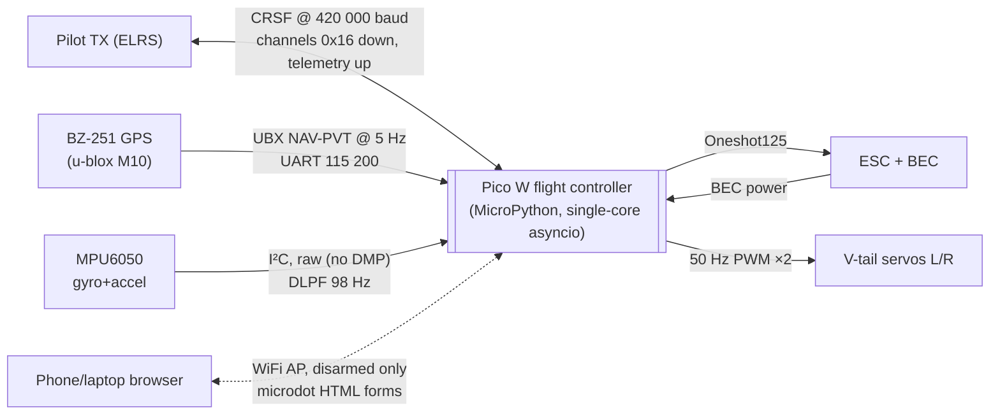
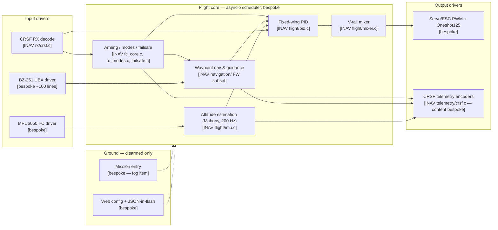
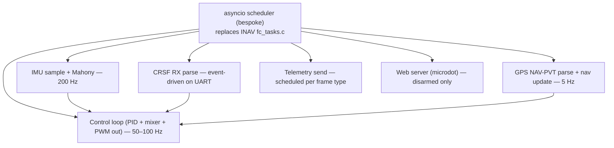
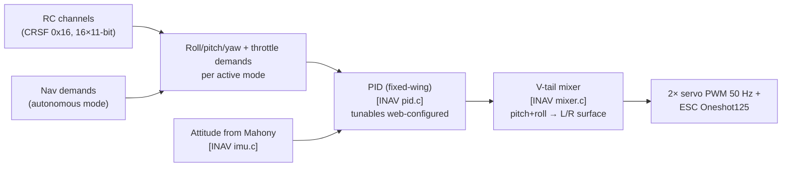
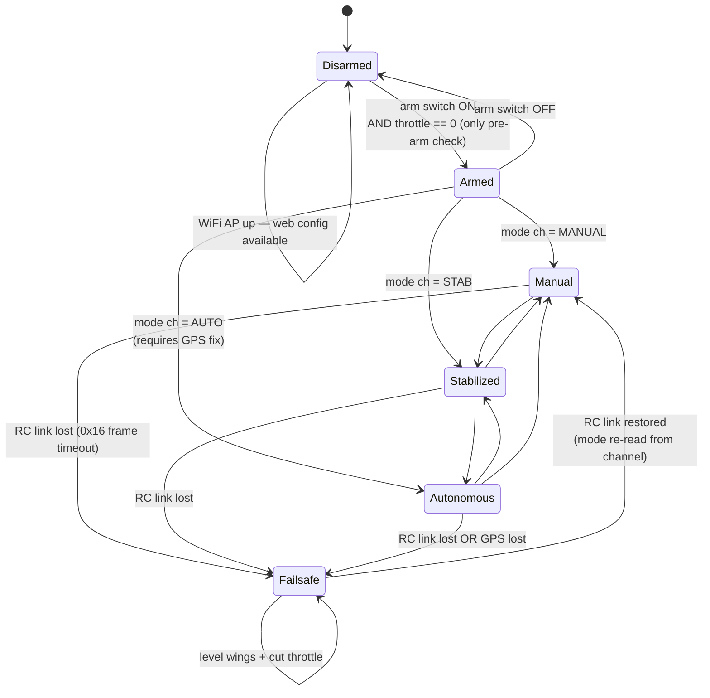
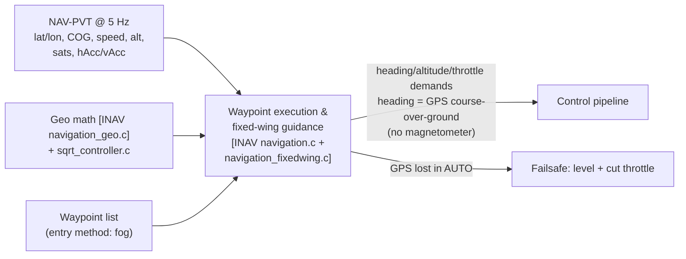
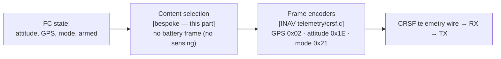
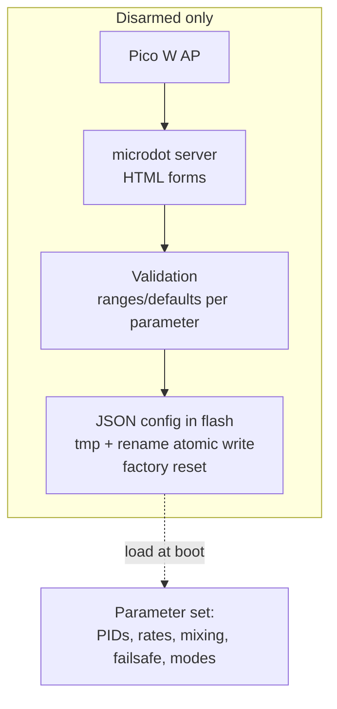
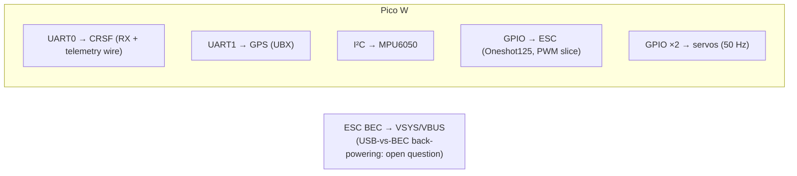

# System diagrams

Hierarchical mermaid documentation of the Pico W fixed-wing FC, from system context down to per-part subcomponents. Each level cites the part doc whose decision it reflects; open parts are marked so the diagram updates as they resolve.

Source legend: **[INAV]** = transpiled from INAV (see [Research: INAV transpile survey](./research-inav-survey.md)) · **[bespoke]** = built fresh.

---

## L0 — System context

Everything outside the firmware: airframe hardware, pilot, ground config.

Decided by: hardware list (map Notes), [CRSF research](./research-crsf-protocol.md), [BZ-251 research](./research-bz251-ubx.md), [MPU6050 research](./research-mpu6050-attitude.md), [platform research](./research-micropython-platform.md). Wire-level pin assignment is open — [Pin map & power](./pin-map-power.md).

---

## L1 — Firmware block diagram (transpile vs bespoke)

Decided by: [INAV transpile survey](./research-inav-survey.md) (module split, GPLv3).

---

## L2 — Subcomponents by part

### Scheduler & loop rates

From [platform research](./research-micropython-platform.md) (single-core asyncio) and [MPU6050 research](./research-mpu6050-attitude.md) (200 Hz estimator).

Exact rates/nesting open — [Control system design](./control-system-design.md).

### Control pipeline

Open: loop rates, rate-vs-attitude nesting per mode, throttle path per mode, parameter list/ranges/defaults — [Control system design](./control-system-design.md).

### Arming, modes & failsafe state machine

Decided behavior (map Notes): TX-switch arming, zero-throttle pre-arm only, 3 modes on a channel, RC loss → level + cut throttle, GPS loss in autonomous → same, WiFi only disarmed.

Structure ported from [INAV] `fc_core.c` + `rc_modes.c` + `failsafe.c`, simplified. Open: transition rules detail, detection timeouts, GPS-lost criteria, re-arm after failsafe — [Flight modes, arming & failsafe](./flight-modes-arming-failsafe.md).

### Navigation data flow

Open: guidance law confirmation (L1/cross-track vs bearing chase), turn coordination without rudder, advance criteria, GPS-only altitude, low-speed heading behavior — [Autonomous navigation design](./autonomous-navigation.md). Fog: mission entry, low-speed heading, altitude reference (map "Not yet specified").

### Telemetry

Open: which frames at what rates, never starving the control loop — [Telemetry content spec](./telemetry-content.md).

### Web config & persistence

All [bespoke] — INAV's CLI/MSP/EEPROM not ported. Open: schema, reboot-vs-live apply, SSID/security — [Web config & parameter persistence](./web-config-persistence.md).

### Pin map & power (placeholder — part open)

Assignment provisional — exact pins and power safety decided in [Pin map & power](./pin-map-power.md).
